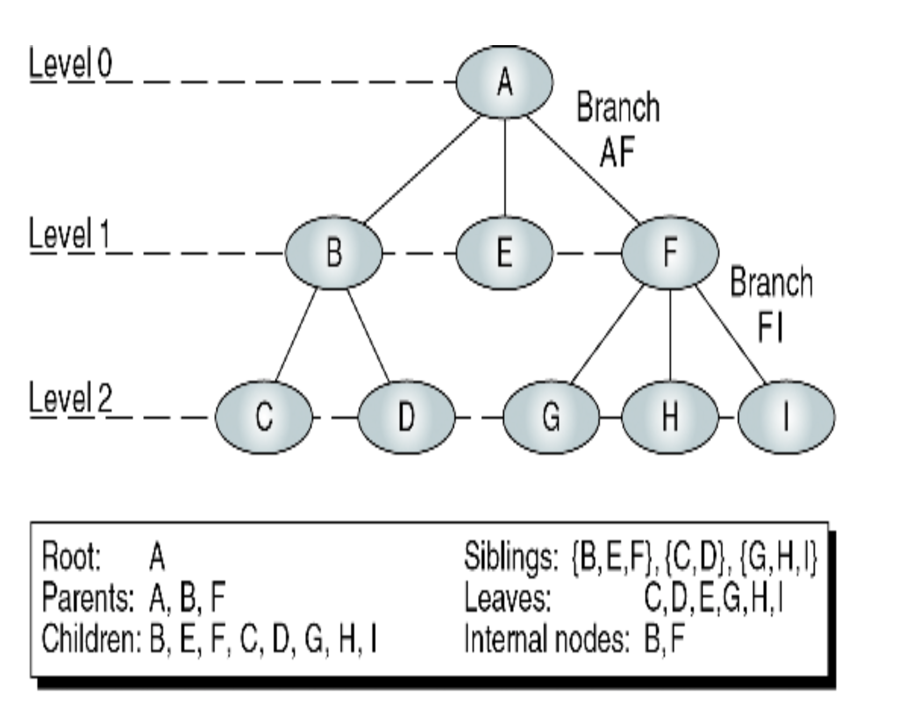

# Data Structure with C
Various data structures implemented in C

## Introduction
Data Strucures are an important part of software development. I have made a similar repository called "Algorithms with Python", but I have decided to use C for this repository, as C has more functionality when it comes to memory address manipulation. I will try to cover all of the basic data structures and implement them in C (with some brief description and analysis of the data structure in this README file).

## C Review
In order to use C to implement data structures, you will need to be familiar with some of the memory manipulation techniques available in the C library. I will go over some of the basic functionalty of pointers, structure/unions, file access methods and dynamic memory manipulation in this section. If you are comfortable with these then I suggest you skip over this part.

### Pointers
A pointer is basically a "data type" that is used to store address locations. Like int is used to store integer values, a pointer is simply a way of telling the compiler that this variable is going to contain an address.

```c
int A = 10;
int* Aptr = &A;

printf("The value of var A is %d and the address it is in %p\n", A, Aptr);
```

The star(*) is a key character that tells the compiler that it is a pointer. The ampersand (&) tells the compiler that we want the address of the following variable. One key point to note here is that not all pointers are the same. For example, if you want the address of an int variable, then you have to define the variable as int*, or if you want the address of a char variable, then you need to use char*.

If you use the * key in front of an already defined pointer, then you are <strong>dereferencing</strong> that pointer. In other words, you are accessing the pointers actual content.

```c
int A = 10;
int* Aptr = &A;

printf("dereferencing A: %d\n", *Aptr); // prints --> 10
```

#### Call-by-reference
We can send the address of a variable to a function instead of sending the actual value of the variable. The following is a simple function that adds two numbers and saves it in the third variable by using the address of all three variables.

```c
void add_by_ref(int* a, int* b, int* result){
    *result = *a + *b; // dereferencing all three variables
}

int main(void){
    int a = 10;
    int b = 100;
    int result;

    add_by_ref(&a, &b, &result); // we are not sending the value of a,b and result but their respective address

    return 0;
}
```

#### Arrays
In c you can access arrays using pointers. In fact it can be easier to use pointers than the square bracket notation we are all too familiar with.
```c
int arr[3] = {1,2,3};

// the following prints the address of the first element of the array
printf("%d\n", arr) ;
printf("%d\n", &arr[0]);

// the following prints the value of the first element of the array
printf("%d\n", *arr);
printf("%d\n", arr[0]);
```

We can also perform pointer arthmetic to find the next address.
```c
printf("%d\n", *(arr+1)); // prints the next element of the array
printf("%d\n", *(arr++));
printf("%d\n", *(arr--)); // prints the previous element of the array (if there is one)
```
There are a lot more features regarding pointers and arrays, especially for strings, but I wont cover that here. Make sure you known how to manipulate and use strings using pointers before moving on to the next part.

#### Pointers to Functions
A pointer to function contains the address of the function in memory. Here is an example of using a function pointer.
```c
int add(int a, int b){
    return a+b;
}

int main(void){

    int (*add_ptr)(int, int) = add; // == int (*add_ptr)(int, int) = &add;
    printf("location of function add in memory: %d\n", add_ptr);

    // using function pointer to call a function, both methods can be used.
    int ret = add_ptr(1, 5);
    printf("return value: %d\n", ret);

    int ret2 = (*add_ptr)(1, 5);
    printf("return value: %d\n", ret);

    return 0;
}
```
You might be wondering why we would use function pointers to begin with, since we can just call a function without using any pointers. However, there are cases where we need to send a function pointer as a parameter to another function. This is called <strong>call-back function</strong>. When you start coding more complicated functions, there will be scenarios where you end up having duplicate code. Call-back functions helps us avoid duplicate code. The example below shows us how we can use quicksort algorithm that is provided by the C library.
```c
#include <stdio.h>
#include <stdlib.h>

int compare(const void* elem1, const void* elem2){
    if((*(int*)elem1) == (*(int*)elem2))
        return 0;
    else if ((*(int*)elem1) < (*(int*)elem2))
        return -1;
    else
        return 1;
}


void print_arr(int arr[], int len){
    for(int i = 0; i < len; i++){
        printf("%d ", arr[i]);
    }
    printf("\n");
}

int main(void){

    int arr[5] = {10, 2, 8, 7, 3};
    int len = sizeof(arr)/sizeof(arr[0]);
    qsort((void*)arr, len, sizeof(int), compare);
    print_arr(arr, len);

    return 0;
}
```
To use the qsort function, you have to import the stdlib.h library. In addition, you have to define he compare function that <strong>must</strong> recieve two const pointers of void type. The const keyword basically tells us that we cant change the address of the two paraemters (elem1, elem2) that the compare function is recieving. Because we are recieving a void pointer, we need to cast in into an int pointer by using (int*). The neat thing about this compare function is that, if we want to change the criteria of the sort (for example, sort by descending order) then we only need to modify the compare function. This idea may seem a little abstract at first but when you start writing more complicated code, you will start to see the benefit of using call-back functions.

### Structures and Unions
C is not an object-oriented programming language. Therefore, there are no objects in C. However, structures have similar properties to objects, and I think its easier to think of structures as C's way of expressing objects.
```c
struct car{
    char* name;
    char* engine_type;
    int price;
    double mileage;
} c1;

int main(void){

    c1.name = "car 1";
    c1.engine_type = "V4";
    c1.price = 100;
    c1.mileage = 12.3;
    printf("car1 enginer type is %s\n", c1.engine_type);

    // declaring another variable c2 of type struct car
    struct car c2 = {"car 2", "V6", 150, 10.5};

    return 0;
}
```
As the code above shows, you can access struct members using the dot operator (like attributes of objects in OOP languages). However, you can also access struct members using struct pointers.
```c
    // continuing on from the code above
    struct car* c1_ptr = &c1;
    printf("car1 price is %d\n", c1_ptr->price); // == *(c1_ptr).price

```
Sometimes it can be a little confusing to type "struct car" to refer to the structure we have created. The <strong>typedef</strong> keyword is bascially an alias to our structure.
```c
    // continuing on from the code above
    typedef struct car Car;
    Car c3;
    c3.mileage = 16.5;

    // or you can just create a new struct with typedef at initialization
    typedef struct{
        char* name;
        int age;
        int year;
    } Student;

    Student s1 = {"Sean", 20, 3};
```

Unions are similar to structures with the exception that all members of union share the same storage space (memory). Because union members share the same storage space, you can only access only one member at a time.
```c
union number{
    int x;
    double y;
};

int main(void){

    union number n1;
    n1.x = 10;
    n1.y = 10.5;
    printf("int value %d and double value %f\n", n1.x, n1.y);

    // because you can only access one member at a time, you cant do this
    union number n2 = {10, 10.5} // will casue an error

    return 0;
}
```
Unions are not used that often, and wont be used for remainder of this repository. I included it to show you that unions exist.

### File Access
There are two methods of accessing files in C; Sequential access and random access. However, I will only cover sequential access here.

You can open files, modify files and also create new ones. We can do all three using C as well. There are many file types but I will only focus on text files (.txt extension). When dealing with files, you will always need a file pointer. A file pointer points to the memory address where the start of the file lives. Lets see an example of <strong>writing</strong> files first.
```c
void write_method(FILE* file_ptr, char* textfile){
    // fopen connects our file pointer to the file we want to write in
    file_ptr = fopen(textfile, "w");

    printf("To stop entering file press control+d...\n");
    // checks for the EOF key, on mac thats control+d
    while (!feof(stdin)){
        char* user_input;
        scanf("%s", user_input);

        // prints the user input to our file using our file pointer
        fprintf(file_ptr, "%s\n", user_input);
    }
    fclose(file_ptr);
}

int main(void){
    FILE* file_ptr; // declaring a file pointer
    char write_file[50] = "new_write.txt" // name of our new file to write in

    write_method(file_ptr, write_file);
}
```
Running the code above will create a new file with all the inputs the user enters. Note the fopen "mode", in the code above "w", tells the computer that we want to write code. There are multiple modes you can specify. Also, be aware of <strong>fclose(file_ptr)</strong>. Depending on the gcc complier you are using, some compilers will give you a warning if you forget to close the memory access to the file you are working on. Just make sure to close the file you are working with when you are done. Now lets look at reading a file.
```c
void read_method_one(FILE* file_ptr, char* textfile){
    // this time we set the fopen mode to read
    file_ptr = fopen(textfile, "r");

    if(file_ptr == NULL){
        printf("could not open file\n");
    }else{
        char current_word[50];
        // gets one word at a time until EOF
        while(fscanf(file_ptr, "%s", current_word) == 1){
            printf("%s\n", current_word);
        }
    }
    fclose(file_ptr);
}

void read_method_two(FILE* file_ptr, char* textfile){
    file_ptr = fopen(textfile, "r");

    if(file_ptr == NULL){
        printf("could not open file\n");
    }else{
        char current_line[50];
        // gets entire line at a time until EOF
        while(fgets(current_line, 50, file_ptr)){
            printf("%s", current_line);
        }
    }
    fclose(file_ptr);
}

int main(void){
    FILE* file_ptr; // declaring a file pointer
    char read_file[50] = "some_text.txt" // make sure this file is in the directory you are working on

    // two methods to read files
    read_method_one(file_ptr, read_file);
    read_method_two(file_ptr, read_file);
}
```
Ive included two methods to access file content; fscanf and fgets. Wih fscanf, the code reads one word at a time, whereas fgets reads the entire line. If you want to modify a file, then just set the fopen mode to "a" for append. For practice, try creating a program where you copy the contents of one file and move it to another new file.

### Dynamic Memory Manipulation
This is the last part of the C review section. When you compile your C code, your computer allocated a certain amount of memory in the RAM (random access memory) to allow for your computer to execute your code. This memory allocation can be divided into four different sections; code/text, global & static variables, stack and heap. If you dont know what this is then I highly recommend that you study this first before moving on. With dyanmic memory manipulation, we are dealing with the heap section of the RAM. Unlike stack where the entire memory is cleared at the end of a stack frame, heap retains all data until the user tells the computer to "free" the allocated memory. Moreover, with dyanmic memory, we can change the size of the memory allocated after the declaration. For example, if you initialize an array of integers of size 10, then the size of that array cant be changed for the entire life time of that code. However, with dynamic memory, this is possible. The four methods we use for dynamic memory manipulation is <strong>malloc(), calloc(), realloc()</strong> and <strong>free()</strong>. Lets first look at malloc() and calloc().
```c
#include <stdio.h>
#include <stdlib.h>

int main(void){

    // casting to int pointer
    int* number_ptr = (int*) malloc(sizeof(int));
    *number_ptr = 100;
    printf("value of our number variable in heap memory: %d\n", *number_ptr);

    // enough memory for 10 integers
    int* numbers_ptr = (int*) malloc(5 * sizeof(int));
    *numbers_ptr = 1;
    *(numbers_ptr + 1) = 2;
    *(numbers_ptr + 2) = 3;

    printf("%d %d %d \n", *(numbers_ptr), *(numbers_ptr + 1), *(numbers_ptr + 2));
    printf("%d\n", numbers_ptr[0]); // returns 1
}
```
What malloc() does is it saves a certain size of memory (represented in bytes) in the heap memory. However, because malloc() does not know what kind of data you are going to store in that slot of memory, it returns a void pointer. You must cast this pointer to the type of pointer you are working with (in the code above, integer). The sizeof(int) code just tells the computer we want memory that is large enough to just fit one int value. However, for numbers_ptr, we have allocated enough memory for 5 integers. Now numbers_ptr can be used like an array. One thing to note is that when malloc() makes memory, it does not initialize the value of the memory space. In other words, in the code above, if we were to write <strong>printf("%d\n", numbers_ptr[4])</strong>, this will return a garbage value.

With calloc(), the only difference is that it initliazes all values to 0.
```c
#include <stdio.h>
#include <stdlib.h>

int main(void){

    int* numbers_ptr = (int*) calloc(10, sizeof(int));

    for(int i = 0; i < 10; i++){
        printf("%d ", *(numbers_ptr + i));
    }printf("\n");

}
```
When using calloc(), we have to insert the number of elements we want our memory slot to fit. In the code above its 10. And because calloc() initializes all elements to 0, when we print all values in our newly initialized memory slot, we get 0 0 0 ...

An important think to remember is when you use memory from the heap, you always <strong>always</strong> have to free the memory you used after you finish using it. Unlike the stack, the heap will retain the memory you allocate throughout the lifetime of the program. If you dont free the heap, then you memory leak can occur which will cause your program to crash. Therefore, when you are using malloc() or calloc() always make sure to free up your memory after usage.

```c
    // continuing on from the code above
    free(numbers_ptr);
```
The last part of dynamic memory allocation is realloc(). This method lets you reallocate or resize the memory partition you made. This is very useful for arrays when the size of the array needs to change. The code below shows realloc() being used.
```c
#include <stdio.h>
#include <stdlib.h>

void print_arr(int arr[], int len){
    for(int i = 0; i < len; i++){
        printf("%d ", arr[i]);
    }printf("\n");
}

void set_arr(int arr[], int len){
    for(int i = 0; i < len; i++){
        arr[i] = 1 + rand()%10;
    }
}

int main(void){

    int* arr_ptr = (int*) malloc(10*sizeof(int));
    set_arr(arr_ptr, 10);
    print_arr(arr_ptr, 10);

    // still retains the value of the first 10 elements
    arr_ptr = realloc(arr_ptr, 20*sizeof(int));
    print_arr(arr_ptr, 20);

    return 0;
}
```
When using realloc(), you dont need to free the previous pointer used. The compiler does that for you. You only need to use the free() method when using malloc and calloc.

This concludes the C review section. Make sure you understand everything I covered here because if you dont then you will have a hard time understanding the upcoming sections in this repository.

## Abstract Data Type (ADT)
A data structure is simply a way of "joining" and organizing data together. An abstract data type is a data declaration packaged together with the operations that are meaningful for the data type. Essentially an ADT is what gives a data structure functionality. We encapsulate the data and the operations on the data, and then hide them from the user. We are creating an ADT of a data structure, and give it functionality so that other users can use the data structure by adding and removing data as an example. However, we hide (encapsulate) the details of the ADT, allowing only the creator of the ADT to actually have full access to the ADT. ADT's need to allow for generic code, meaning that it must allow for mutiple data types such as ints, doubles, char, etc... In this section, I will cover some of the popular data structures used in the real world, and also provide the ADT for that data structure so that users can use and data structure created.

## Linear Lists
Linear lists are essentially an array with certain insertion and deletion restrictions. There are three different linear lists that this section will cover; linked list, stack and queue. Although the basic structure of linear lists are all different, they do share a common property: <strong>overflow</strong>. Oveflow is when you try to insert a new element to your list when the memory is full. Therfore, you need to make sure your memory has enough space before trying to add a new element.

### 1. Linked List
A linked list is similar to an array. However, unlike arrays, linked lists do not necessarily order data in a sequential manner. Instead, each element in a linked-list "points" to the next element. There are many varitations of a linked list, some of which are not considered linear. For example, some linked list can point to multiple elements. For this repository, I will only implement a <strong>linear linked list</strong> (each element can only point to 1 or 0 elements).

The benefits of a linked list is that inserting and removing elements can be done very efficiently. Instead of going through the entire list (arrays to do this), a linked list can very quickly insert and remove elements. However, one drawback is the fact that searching a linked list can be computationally expensive, if we use sequential search. However, we can improve this if we insert elements in increasing order, creating an ordered linked list. If this is the case, we can use binary search to search the linked list.

When using linked lists, we refer to each element as <strong>nodes</strong>. Each node contains <strong>data</strong>(the actual value of the node) and a <strong>link</strong> (the address of the next node). In C, we will represent a node using a struct. The following code will help you understand how linked lists work.
```c
#include <stdio.h>
#include <stdlib.h>

typedef struct node{
    void* data;
    struct node* link;

}Node;

Node* createNode(void* value){
    Node* nodePtr = (Node*) malloc(sizeof(Node));
    nodePtr->data = value;
    nodePtr->link = NULL;
    return nodePtr;
}

int main(void){

    int* new_int = (int*) malloc(sizeof(int));
    *new_int = 10;
    Node* n1 = createNode(new_int);

    // cast void* to int*, then dereference
    printf("fist node value: %d\n", *(int*)n1->data);

```
We first create a Node struct that holds a void pointer to the data that the node contains, and a link to a different struct node. The createNode function simply initializes a new node with the value we want the node to carry. Adding more nodes to our linked list is very easy.
```c
    // continuing from above
    new_int = (int*) malloc(sizeof(int));
    *new_int = 100;
    n1->link = createNode(new_int);

    char* new_char_node = (char*) malloc(sizeof(char));
    *new_char_node = 'A';
    n1->link->link = createNode(new_char_node);

    printf("first node value: %d\nsecond node value: %d\nthird node value: %c\n", *(int*)n1->data, *(int*)n1->link->data, *(char*)n1->link->link->data);

    return 0;
}
````
Because our node struct recieves a void pointer, we can allow our linked list to accept nodes with different data types. This is called generic coding. The code in the linked list folder contains a C file that has the ADT implementation of a linked list. All preceding examples of linear data structures (stacks and queues) will follow this structure of using a Node struct to represent elements in the data structure. Once you understand linked lists, stacks and queues will be easy to understand.

### 2. Stacks
A stack is a linear list with insertion and deletion restrictions. When using stacks, we can only insert (push) data to the "top" of the stack, and we can only remove (pop) data from the top as well. Think of a stack of books, the last book we place on top of the stack is also going to be the first book we remove from the stack. Because of this restriction, we call stacks <strong>LIFO</strong> (last-in first-out). My implementation of a stack is similar to the linked list implementation. I tried to use the same variable and function names as to that of the linked_listADT.c file. You can check out the Stack folder to see the ADT implementation of a stack in C. Because of the nature of an ADT structure, its difficult to print the contents of the stack using one function. Therefore, I created a function called <strong>int_print_stack(Stack* Stack_ptr)</strong> that has the ability of printing the contents of the stack only when the data inside the stack is an integer. The code below shows how the stack works if you declare all the data to be of int.
```c
int main(void){

    // creates stack
    Stack* Stack_ptr = create_stack();

    int data1 = 10;
    push(Stack_ptr, &data1);

    int data2 = 20;
    push(Stack_ptr, &data2);

    int data3 = 30;
    push(Stack_ptr, &data3);

    void* head_data = peak(Stack_ptr);
    int_print_stack(Stack_ptr);
    printf("head node data: %d\n", *(int*)head_data);

    destroy_stack(Stack_ptr);
    return 0;
}
```

### 3. Queues
A queue is also a linear list, but like a stack it has insertion and deletion restrictions. When inserting (enqueue) an element to a queue, we insert the element to the head/start of the queue. When deleting (dequeue) an element, we delete the element at the tail/end of the queue. An easy way to think about queues is by imagining a line. When you are in line to buy groceries, then the person who came first to the line leaves first, and whenever a new person joins the line, they join at the end of the line. Therefore, a queue is known as FIFO (first-in first-out). The only difference with a queue and a stack is the fact that new elements are added to the end of the queue, rather than at the start (like a stack). You can check out my implementation of a Queue in the Queue folder. Again, due to the nature of an ADT structure, you cant print the contents of the queue using one function. So like the stack file, I created a function where you can print the contents of the queue is all the data in the queue are of int type.

This concludes the linear list section of this repository. Try to implement all three linear list structures by yourself.

## Trees
In this section I will discuss a non-linear data structure called trees. All trees have a starting element (node) called the root. Imagine we have two nodes, A and B. If node A points to node B, then we say that node A is the parent node of node B and that node B is the child node of node A. In a tree, a node cannot have more than one parent, but can have many childrens.

The <strong>degree</strong> of a node is the number of links coming in and out of the node in question. Any link that is coming into the node is called the indegree, and any link going out of the node is called the outdegree. Bascially the indegree tells us how many parents the node has, whilst the outdegree tells us how many children the node has. As mentioned above, the indree of any node in a tree (except the root) is 1 (since all nodes can only have one parent). The indegree of the root is 0 because the root is the starting node of the tree.

The <strong>leaf</strong> is any node with an outdegree is 0 (a node with no child nodes). Two or more nodes with the same parent node are called <strong>siblings</strong>.

The <strong>level</strong> of a node is the distance from that node to the root node. The root node has a level of 0. The <strong>depth/height</strong> of a tree is the largest level plus 1. The image below should clear up some of these terminologies (depth of the image below is simply 3).

<p align="center">
  
</p>

### Binary Trees
A binary tree is one where all nodes in the tree cannot have more than 2 children (outdegree must be either 0, 1 or 2). We can calculate the minimum depth of a binary tree using this equation <em>floor(log_2(N))+1</em>. N represents the number of nodes in the binary tree. The maximum depth of a binary tree is simply the number of nodes N. Likewise, given the depth of the binary tree, we can calculate the minimum and maximum number of nodes in that tree. The minimum number of nodes is simply <em>2^d -1</em>, while the maximum number of nodes is d, where d is the depth of the binary tree.

#### Binary Search Tree
A binary search tree is one variant of the binary tree. Searching, inserting and deleting elements are efficient when using a binary search tree structure. In order to create a valid binary tree, we need to keep three properties:
1. All items in the left subtree are less than the root.
2. All items in the right subtree are greater than or equal to the root.
3. <strong>Each subtree is itself a binary search tree.</strong>

When using a binary search tree, one algorithm we use often is <strong>recursion</strong>. If you are not sure about recursion check out my algorithms with python repository. The reason why recursion is suitable for BST (binary search tree) is because of condition 3 (each subree is itself a BST). So if you dont understand recursion, I highly recommend you study recursion first before coming back to BST.

I have created a basic BST program using the following structs:
```c
typedef struct node{
    int data;
    struct node* left;
    struct node* right;
} NODE;

typedef struct tree{
    NODE* root_node;
    int count;
} TREE;
```
Each node in the BST will contain an integer value called data, and pointers to the left and right child. The tree struct simplyly contains the root node of the BST (you can add aditional information such as the number of nodes in the BST if you want to).

<strong>Inserting Nodes</strong>
```c
NODE* create_node(int val){
    NODE* new_node = (NODE*) malloc(sizeof(NODE));

    if(!new_node){
        return NULL;
    } else{
        new_node->data = val;
        new_node->left = NULL;
        new_node->right = NULL;
    }
    return new_node;
}

NODE* insert_node(NODE* node, NODE* new_node){
    // node represents the root node when the function is called first.
    if(!node){
        node = new_node;
        return node;
    }

    if(node->data > new_node->data){
        node->left = insert_node(node->left, new_node);
        return node;
    } else{
        node->right =  insert_node(node->right, new_node);
        return node;
    }
}

int main(void){

    TREE* tree = create_tree();
    if(!tree){
        printf("memory full.\n");
    }

    int values[8] = {9,2,1,10,5,3,18,3};

    // inserting values into binary tree.
    for(int i = 0; i < sizeof(values)/sizeof(values[0]); i++){
        NODE* new_node = create_node(values[i]);
        if(!new_node){
            printf("memory is full, could not insert %d.\n", values[i]);
        } else{
            tree->root_node = insert_node(tree->root_node, new_node);
        }
    }
    return 0;
}
```
In order to insert a new node, we use the <strong>create_node</strong> function to first create a node of type struct node. Then, in the <strong>insert_node</strong> function, we use recursion to indetify the location we want to insert our new node into. For example, consider the case when the values we want to insert is simply 9,2 and 1. The root node is created and 9 is assigned. Then when we insert the value 2, and one recursiv call is made. When we insert the value 2, two recursive calls are made. In all three cases, when the insert_node function terminates, we recieve the <strong>root node</strong> of the BST. This concept might be a little difficult to grasp so try writing down the function execution sequence.


